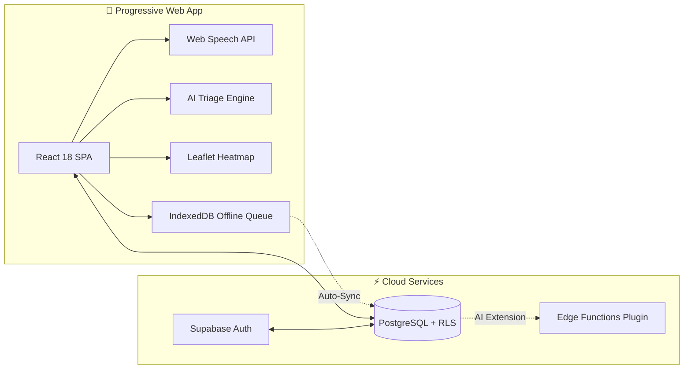

<div align="center">

# 🐄 JeevSetu (जीवसेतु / జీవసేతు)
### *Next-Gen Multilingual Livestock Health Surveillance & Outbreak Early-Warning System*

<br/>

[](https://6a9530874557b930902774e0--bespoke-quokka-09dc6f.netlify.app/)
[](https://github.com/GavaraNeha/JeevSetu_SIH)
[](https://react.dev/)
[](LICENSE)

<br/>

**[🌐 Experience Live Demo](https://6a9530874557b930902774e0--bespoke-quokka-09dc6f.netlify.app/)** • **[📖 Read Documentation](#-system-architecture)** • **[💻 Explore Codebase](https://github.com/GavaraNeha/JeevSetu_SIH)**

---

</div>

<br/>

## ✨ Key Highlights at a Glance

| ⚡ **< 100ms** | 🗣️ **3 Languages** | 📡 **100% Offline** | 🛡️ **Zero API Cost** |
| :---: | :---: | :---: | :---: |
| Automated AI Triage | Speech-to-Text (EN/HI/TE) | IndexedDB Sync Queue | Browser-Native Stack |

<br/>

> [!TIP]
> **JeevSetu** (Bridge of Life) connects **Rural Farmers**, **Veterinary Officials**, and **District Health Authorities** into a unified digital surveillance network to stop livestock disease outbreaks before they spread.

<br/>

---

## 🌟 Standout Features

<div align="center">

```
┌───────────────────────────┐      ┌───────────────────────────┐      ┌───────────────────────────┐
│  🎙️ Multilingual Voice   │      │ ⚡ Automated Triage Engine│      │ 🗺️ Geospatial Outbreak Map│
│  Dictate symptoms in EN,  │ ───► │ Instant severity scoring  │ ───► │ Real-time district        │
│  HI, and TE seamlessly    │      │ & mortality escalation    │      │ disease heatmaps          │
└───────────────────────────┘      └───────────────────────────┘      └───────────────────────────┘
```

</div>

- 🎙️ **Multilingual Voice Input (Speech-to-Text)**: Speak symptoms naturally in English (`en-IN`), Hindi (`hi-IN`), or Telugu (`te-IN`) using zero-cost browser-native speech recognition.
- 💀 **Sudden Death / Mortality Escalation**: Mortality reports automatically trigger highest severity (**Outbreak Risk**) and alert regional outbreak cluster tracking.
- 📶 **Offline-First Resilience**: Reports filed without cellular coverage queue safely in IndexedDB and auto-sync when network returns.
- 🎨 **Full-Screen Responsive Portal**: Designed with an agricultural visual identity, split-screen landing, and touch-first mobile layouts.
- 🐃 **Native Indian Breed Database**: Complete localization for Indian livestock breeds across Cattle, Buffalo, Goat, Sheep, Pig, and Poultry.

<br/>

---

## 🏗️ System Architecture



<br/>

---

## 🛠️ Tech Stack

```text
  Frontend   ────► React 18  • TypeScript 5  • Vite 5  • Tailwind CSS
  Database   ────► Supabase  • PostgreSQL  • Row Level Security (RLS)
  Speech-to-Text ─► Browser-Native Web Speech API (en-IN, hi-IN, te-IN)
  Mapping    ────► Leaflet  • React-Leaflet
  Hosting    ────► Netlify Edge CDN
```

<br/>

---

## 👥 Role-Based Workflows

```carousel
### 🌾 1. Farmer / Field Worker
- Voice-assisted symptom reporting in native language
- Automated AI triage recommendations & emergency tips
- Photo uploads & individual animal medical profile history
<!-- slide -->
### 🩺 2. Veterinary Assistant Surgeon (VAS)
- Real-time case queue management (Open → In Progress → Closed)
- One-click lab sample collection requests
- Lab result logging & prescription notes
<!-- slide -->
### 🛡️ 3. District Veterinary Officer (DVO)
- Geospatial disease outbreak cluster heatmaps
- Automatic 3-case village outbreak triggers
- Geo-targeted emergency advisory broadcast tool
```

<br/>

---

## 🔍 Innovation & Evaluation Matrix

<details>
<summary><b>📌 Click to Expand SIH Evaluation Criteria (Relevance, SMART, Applicability & IP)</b></summary>

<br/>

### 1. **Relevance & Market Presence**
- **The Challenge**: Foot and Mouth Disease (FMD) and Lumpy Skin Disease (LSD) cause **₹20,000+ Crore annual losses** in India due to delayed reporting.
- **The Solution**: JeevSetu provides real-time digital surveillance, bridging the gap between illiterate farmers and district health officers.

### 2. **Applicability & Usability**
- Applicable across smallholder farms, commercial dairies, gaushalas, and government veterinary clinics.
- Zero literacy barrier with voice dictation, color-coded badges, and offline PWA support.

### 3. **Scalability & Sustainability**
- Stateless React SPA on Netlify CDN + Supabase PostgreSQL RLS scaling to millions of records.
- 100% free open-source stack (0 third-party API costs). Paperless workflows reduce veterinary carbon footprint.

### 4. **Intellectual Property (IP)**
- Proprietary Rule-Based Triage & Disease Cluster Algorithm.
- Localized Indian Breed Translation Dataset.
- Open source under the permissive **MIT License**.

</details>

<br/>

---

## 🚀 Quick Start & Installation

```bash
# Clone repository
git clone https://github.com/GavaraNeha/JeevSetu_SIH.git
cd JeevSetu_SIH

# Install dependencies & run
npm install
npm run dev

# Verify types & build for production
npm run typecheck
npm run build
```

<br/>

---

<div align="center">

© 2026 **JeevSetu Team**. Built for Smart India Hackathon (SIH).

</div>
