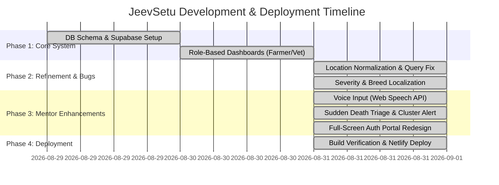

# 🐄 JeevSetu (जीवसेतु / జీవసేతు)
### *Next-Gen Multilingual Livestock Health Surveillance & Outbreak Early-Warning System*

[](https://6a9530874557b930902774e0--bespoke-quokka-09dc6f.netlify.app/)
[](https://github.com/GavaraNeha/JeevSetu_SIH)
[](LICENSE)

---

## 🌐 Live Deployment & Project Links
- 🚀 **Deployed Web Application**: [https://6a9530874557b930902774e0--bespoke-quokka-09dc6f.netlify.app/](https://6a9530874557b930902774e0--bespoke-quokka-09dc6f.netlify.app/)
- 💻 **Source Code Repository**: [https://github.com/GavaraNeha/JeevSetu_SIH](https://github.com/GavaraNeha/JeevSetu_SIH)

---

## 📌 Problem Statement & Relevance of Solution

### **The Real-World Challenge in Society & Agriculture**
India holds the largest livestock population in the world (over 536 million animals), contributing significantly to rural livelihoods. However, animal healthcare faces critical operational vulnerabilities:
1. **Delayed Outbreak Detection**: Contagious livestock diseases (e.g. Foot and Mouth Disease, Lumpy Skin Disease, Anthrax, PPR) frequently spread unchecked across villages before government health authorities receive formal reporting.
2. **Language & Literacy Barriers**: Rural farmers struggle to complete complex medical text forms or communicate symptoms in formal/English terminology.
3. **Connectivity Blindspots**: Remote agricultural areas often lack stable internet access, resulting in lost or delayed disease reports.
4. **Fragmented Communication**: Lack of real-time coordination between farmers, local Veterinary Assistant Surgeons (VAS), and District Veterinary Officers (DVO).

### **The JeevSetu Solution**
**JeevSetu** (Bridge of Life) provides a unified, multilingual, offline-first digital surveillance ecosystem connecting **Farmers**, **Veterinary Officials**, and **District Authorities**. It enables instant symptom reporting, automated rule-based AI triage, geospatial cluster tracking, and rapid emergency advisory broadcasts.

---

## 💡 Industry & Market Presence (Existing vs JeevSetu)

| Capability / Feature | Traditional Systems (INAPH / Manual) | Existing Mobile Apps | **JeevSetu Platform** |
| :--- | :---: | :---: | :---: |
| **Multilingual Voice Input (Speech-to-Text)** | ❌ No | ❌ Rare / Paid | ✅ **Native Web Speech API (EN, HI, TE)** |
| **Automated Severity Triage** | ❌ Manual Vet Review | ❌ Basic static FAQ | ✅ **Instant Rule-Based 4-Tier Triage Engine** |
| **Mortality / Sudden Death Escalation** | ❌ Delayed | ❌ Standard ticket | ✅ **Instant Outbreak-Risk & Village Cluster Trigger** |
| **Offline Field Capability** | ❌ Requires Active Network | ❌ Limited | ✅ **IndexedDB Offline Queue & Auto-Sync** |
| **District Outbreak Heatmap** | ❌ Periodic Static PDF | ❌ Basic Pins | ✅ **Real-Time Interactive Geospatial Leaflet Map** |
| **Normalized Region Analytics** | ❌ Data Duplication | ❌ Duplicate Entries | ✅ **Title-Case Location Normalization Pipeline** |

---

## 🚀 Key Improvements & Mentor-Suggested Features Implemented

Following feedback received during mentorship sessions, the following major features were added:

1. 🎙️ **Multilingual Voice Input (Speech-to-Text)**:
   - Integrated browser-native `SpeechRecognition` API supporting **English (`en-IN`)**, **Hindi (`hi-IN`)**, and **Telugu (`te-IN`)**.
   - Added microphone buttons alongside every text input field (Symptom Notes, Animal Name, Tag Number, Resolution Notes, Advisory Title/Body).
   - Illiterate farmers can dictate symptoms naturally; transcribed text appends smoothly without overwriting typed text.

2. 💀 **Sudden Death / Mortality Tracking & Escalation**:
   - Added `"Sudden death / Mortality"` across **all 6 species** (Cattle, Buffalo, Goat, Sheep, Pig, Poultry).
   - Selecting sudden death automatically forces triage severity to **Outbreak-Risk / Needs Urgent Attention** and triggers village cluster tracking.

3. 🎨 **Full-Screen Responsive Landing & Auth Portal**:
   - Rebuilt split-screen login/signup interface (`100vw × 100vh`) with a farm hero section, quick language switcher, and full mobile responsiveness.

4. 🐃 **Complete Native Breed Localization**:
   - Built a comprehensive translation dataset for Indian-origin breeds across all 6 species (e.g., Gir → గిర్, Murrah → మురా, Osmanabadi → उस्मानाबादी).

5. 🗺️ **Normalized Location Analytics**:
   - Implemented title-case string normalization (`normalizeLocation`) to eliminate duplicate region cards (e.g. merging `"kakinada"` and `"Kakinada"`).

---

## 🎯 Feasibility Analysis (SMART Criteria)

### 📌 **S — Specific**
JeevSetu delivers precise, role-tailored workflows:
- **Farmers**: Report symptoms, dictate notes via voice, view triage recommendations, and track animal medical history.
- **Veterinary Officials**: Manage open cases, update status (Open → In Progress → Closed), request lab sample collections, and log lab results.
- **District Officials**: Monitor outbreak heatmaps, track village clusters, and broadcast geo-targeted emergency advisories.

### 📊 **M — Measurable**
- **Triage Speed**: Symptom severity calculated in **< 100ms**.
- **Cluster Alert Threshold**: Automatic outbreak trigger when **≥ 3 high-severity cases** occur in a village within **7 days**.
- **Stat Card Re-computation**: Live, instantaneous recalculation of Dashboard metrics upon case updates or lab referrals.
- **Data Integrity**: Zero TypeScript errors (`npm run typecheck`), 100% build pass rate (`npm run build`).

### 🛠️ **A — Attainable**
- Built entirely with lightweight, production-proven modern web technologies: **React 18**, **Vite**, **TypeScript**, **Tailwind CSS**, **Supabase (PostgreSQL)**, **Leaflet Maps**, and **Web Speech API**.
- **Zero Third-Party API Cost**: Uses browser-native speech recognition and free open-source map tiles.

### 💡 **R — Realistic**
- Solves real connectivity challenges in rural India via **IndexedDB offline queuing**—farmers can report symptoms without cellular coverage, and reports auto-sync once connection is restored.
- Works seamlessly across smartphones, tablets, and desktop browsers without mandatory App Store downloads.

### ⏱️ **T — Timeline**



---

## 🛠️ Technology Stack

- **Frontend**: React 18, TypeScript, Vite, Tailwind CSS, Lucide Icons
- **Backend & Database**: Supabase (PostgreSQL), Row Level Security (RLS)
- **Speech Recognition**: Browser-native Web Speech API (`SpeechRecognition`)
- **Geospatial Mapping**: Leaflet & React-Leaflet
- **Offline Storage**: IndexedDB / Service Queue
- **Hosting / Deployment**: Netlify Production Hosting

---

## 💻 Local Setup Instructions

```bash
# 1. Clone the repository
git clone https://github.com/GavaraNeha/JeevSetu_SIH.git

# 2. Navigate to the project directory
cd JeevSetu_SIH

# 3. Install dependencies
npm install

# 4. Run typecheck
npm run typecheck

# 5. Start the development server
npm run dev

# 6. Build for production
npm run build
```

---

© 2026 **JeevSetu Team**. Developed for Smart India Hackathon (SIH).
